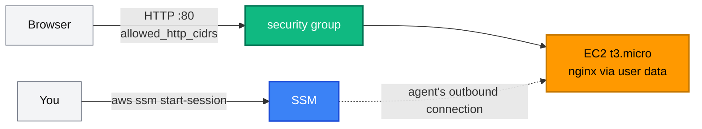

[← Project 02 · Custom Three-Tier VPC](../02-custom-vpc/README.md) | [🏠 Home](../../README.md) | [📚 Learning Path](../../docs/00-learning-roadmap/README.md) | [⬆ Projects](../README.md) | [Project 04 · VPC + EC2 Stack →](../04-vpc-ec2-stack/README.md)

# Project 03 · EC2 Web Server

🟢 Beginner · Do it after the [EC2 track](../../aws-services/ec2/README.md) · 💰 **Hourly**: one `t3.micro` + one public IPv4 address

## Requirements

1. One Amazon Linux 2023 instance in the default VPC serving a web page with nginx.
2. The page content (title, environment) comes from Terraform variables, rendered into the boot script with `templatefile()`.
3. HTTP (80) open only to a configurable list of CIDRs; **no SSH**. Administration through SSM Session Manager.
4. Outbound only HTTP/HTTPS (package installs, SSM).
5. IMDSv2 required, encrypted root volume.
6. Changing the boot script must replace the instance.
7. Output the website URL and the instance ID.

## Architecture



## Concepts used

| Concept | Where |
| --- | --- |
| `templatefile()` with variables; `$${...}` to escape for bash | [templates/user_data.sh.tftpl](templates/user_data.sh.tftpl) |
| `user_data_replace_on_change` | `aws_instance.web` |
| `for_each` over a list of CIDRs converted with `toset()` | ingress rules |
| IAM role + instance profile for SSM | `aws_iam_role.web` |
| `name_prefix` + `create_before_destroy` | `aws_security_group.web` |

## Reference solution

[main.tf](main.tf) · [variables.tf](variables.tf) · [outputs.tf](outputs.tf) · [templates/](templates/)

## Run it

```bash
terraform init
terraform apply -var 'allowed_http_cidrs=["'"$(curl -s https://checkip.amazonaws.com)"'/32"]'   # only you
terraform output website_url
```

(Or apply with the default `0.0.0.0/0` for a public page.)

## Verify

```bash
sleep 90   # nginx installs at first boot
curl -s "$(terraform output -raw website_url)"
aws ssm start-session --target "$(terraform output -raw instance_id)"
```

Change `page_title` and plan: the instance is **replaced** (new user data). Apply and check the new page.

## Cleanup

```bash
terraform destroy
```

## Extensions

- Put the page's HTML into S3 and have the boot script download it using the instance role (least privilege on one object).
- Add a CloudWatch alarm on `CPUUtilization`.
- Move to a custom VPC → [Project 04](../04-vpc-ec2-stack/README.md).

---

[← Project 02 · Custom Three-Tier VPC](../02-custom-vpc/README.md) | [🏠 Home](../../README.md) | [📚 Learning Path](../../docs/00-learning-roadmap/README.md) | [⬆ Projects](../README.md) | [Project 04 · VPC + EC2 Stack →](../04-vpc-ec2-stack/README.md)
