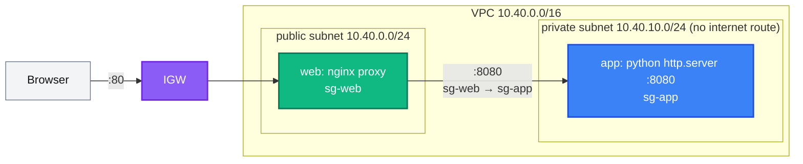

[← Project 03 · EC2 Web Server](../03-web-server/README.md) | [🏠 Home](../../README.md) | [📚 Learning Path](../../docs/00-learning-roadmap/README.md) | [⬆ Projects](../README.md) | [Project 05 · Secure S3 with KMS →](../05-secure-s3/README.md)

# Project 04 · VPC + EC2 Stack

🟡 Intermediate · Do it after the [EC2 track](../../aws-services/ec2/README.md) · 💰 **Hourly**: two `t3.micro` + one public IPv4 address (no NAT gateway)

## Requirements

1. A custom VPC with one **public** and one **private** subnet.
2. An **app server** in the private subnet: no public IP, serves HTTP on port 8080, and must work **without internet access** (no NAT gateway).
3. A **web proxy** in the public subnet: nginx on port 80 forwarding to the app server's private IP.
4. Security groups chained by reference: internet → web :80; web → app :8080; nothing else inbound.
5. Admin access to the web server through SSM only. The app server needs no AWS permissions — so it gets **no** IAM role.
6. Output the public URL and the app server's private IP.

## Architecture



## Concepts used

| Concept | Where |
| --- | --- |
| Splitting a configuration into `network.tf`, `security.tf`, `compute.tf` | this folder |
| Referencing one instance's attribute in another's user data (implicit dependency) | `aws_instance.web.user_data` uses `aws_instance.app.private_ip` |
| Security group chaining with `referenced_security_group_id` | [security.tf](security.tf) |
| Private subnet using the VPC main route table | [network.tf](network.tf) |
| `systemd-run` in user data to keep a process running | [compute.tf](compute.tf) |
| Least privilege by **omitting** a role, with a documented Checkov exception | `aws_instance.app` |

## Reference solution

[network.tf](network.tf) · [security.tf](security.tf) · [compute.tf](compute.tf) · [variables.tf](variables.tf) · [outputs.tf](outputs.tf)

## Run it

```bash
terraform init
terraform apply
sleep 120
curl -s "$(terraform output -raw website_url)"     # "Hello from the PRIVATE app server"
```

## Verify isolation

```bash
aws ec2 describe-instances --filters "Name=tag:Name,Values=tf-learning-p04-app" \
  --query "Reservations[0].Instances[0].PublicIpAddress"      # null
```

From an SSM session on the web server: `curl -s http://<app_private_ip>:8080` works. From your laptop, the app server's private IP is unreachable.

## Cleanup

```bash
terraform destroy
```

## Extensions

- Add a second AZ and a load balancer → that is [Project 08](../08-highly-available-web/README.md).
- Add a NAT gateway (toggle) and an S3 gateway endpoint; compare costs.

---

[← Project 03 · EC2 Web Server](../03-web-server/README.md) | [🏠 Home](../../README.md) | [📚 Learning Path](../../docs/00-learning-roadmap/README.md) | [⬆ Projects](../README.md) | [Project 05 · Secure S3 with KMS →](../05-secure-s3/README.md)
