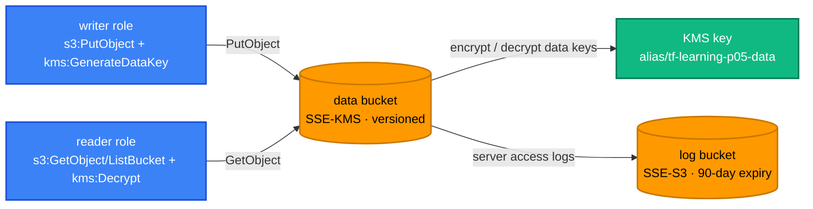

[← Project 04 · VPC + EC2 Stack](../04-vpc-ec2-stack/README.md) | [🏠 Home](../../README.md) | [📚 Learning Path](../../docs/00-learning-roadmap/README.md) | [⬆ Projects](../README.md) | [Project 06 · Serverless Application →](../06-serverless-application/README.md)

# Project 05 · Secure S3 with KMS

🟡 Intermediate · Do it after the [KMS track](../../aws-services/kms/README.md) · 💰 One customer managed KMS key (**monthly charge**, prorated) + requests; buckets nearly free

## Requirements

1. A **data bucket**: versioned, private, ACLs disabled, default encryption **SSE-KMS** with a customer managed key and S3 Bucket Keys.
2. Bucket policy: deny non-HTTPS requests; deny uploads that explicitly request a **different** encryption type.
3. **Server access logs** for the data bucket delivered to a separate log bucket (which must use SSE-S3 — log delivery doesn't support SSE-KMS on the target).
4. Lifecycle: move objects to `GLACIER_IR` after 90 days, expire old versions after 30, abort incomplete uploads after 7; expire logs after 90 days.
5. Two roles people in the account can assume: **writer** (upload only) and **reader** (list + download only). Each needs both the **S3** and the **KMS** permission — prove that one without the other fails.
6. The KMS key policy must keep the account in control (no lock-out).

## Architecture



## Concepts used

| Concept | Where |
| --- | --- |
| KMS key policy + IAM policy working together | [kms.tf](kms.tf), [iam.tf](iam.tf) |
| Multiple conditions in one statement (AND): `Null` + `StringNotEquals` | `DenyNonKmsEncryption` in [buckets.tf](buckets.tf) |
| Service principal with `aws:SourceArn` + `aws:SourceAccount` | log bucket policy |
| Trust policy for principals in the same account | `assume_from_account` |
| Resource-specific Checkov exceptions with reasons | `#checkov:skip` in [buckets.tf](buckets.tf), [kms.tf](kms.tf) |

## Reference solution

[kms.tf](kms.tf) · [buckets.tf](buckets.tf) · [iam.tf](iam.tf) · [outputs.tf](outputs.tf) · [variables.tf](variables.tf)

## Run it

```bash
terraform init
terraform apply
```

## Verify: the roles work, and only as intended

Your own identity needs permission to `sts:AssumeRole` (an admin in a sandbox has it).

```bash
BUCKET=$(terraform output -raw data_bucket)
assume() {  # prints export lines for a role's temporary credentials
  aws sts assume-role --role-arn "$1" --role-session-name p05 \
    --query 'Credentials.[AccessKeyId,SecretAccessKey,SessionToken]' --output text |
  awk '{print "export AWS_ACCESS_KEY_ID="$1" AWS_SECRET_ACCESS_KEY="$2" AWS_SESSION_TOKEN="$3}'
}

# As the writer: upload works, download is denied
( eval "$(assume "$(terraform output -raw writer_role_arn)")"
  echo "quarterly numbers" | aws s3 cp - "s3://$BUCKET/report.txt"
  aws s3 cp "s3://$BUCKET/report.txt" - || echo "writer cannot read: expected" )

# As the reader: download works, upload is denied
( eval "$(assume "$(terraform output -raw reader_role_arn)")"
  aws s3 cp "s3://$BUCKET/report.txt" -
  echo x | aws s3 cp - "s3://$BUCKET/x.txt" || echo "reader cannot write: expected" )

# Explicitly asking for AES256 is rejected by the bucket policy
echo x | aws s3 cp - "s3://$BUCKET/aes.txt" --sse AES256 || echo "denied: expected"
```

**Experiment:** remove the `ReaderDecrypt` statement from the key policy **and** `kms:Decrypt` from the reader's IAM policy, apply, and try the download again: S3 permission alone is not enough to read KMS-encrypted objects.

Access logs appear in the log bucket under `access-logs/` after some minutes (delivery is best-effort and delayed).

## Cleanup

```bash
terraform destroy      # the KMS key enters a 7-day pending-deletion period
```

## Extensions

- Require MFA for the reader role (`aws:MultiFactorAuthPresent` condition in the trust policy).
- Add S3 Object Lock (compliance mode) for a write-once audit bucket.
- Replicate to another Region with a second KMS key.

---

[← Project 04 · VPC + EC2 Stack](../04-vpc-ec2-stack/README.md) | [🏠 Home](../../README.md) | [📚 Learning Path](../../docs/00-learning-roadmap/README.md) | [⬆ Projects](../README.md) | [Project 06 · Serverless Application →](../06-serverless-application/README.md)
