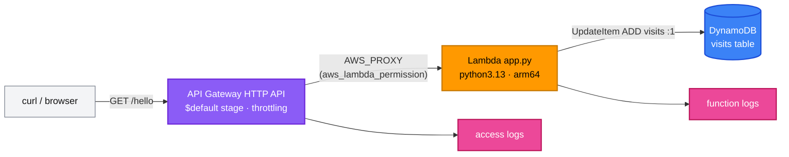

[← Project 05 · Secure S3 with KMS](../05-secure-s3/README.md) | [🏠 Home](../../README.md) | [📚 Learning Path](../../docs/00-learning-roadmap/README.md) | [⬆ Projects](../README.md) | [Project 07 · Event-Driven Architecture →](../07-event-driven-architecture/README.md)

# Project 06 · Serverless Application

🟡 Intermediate · Do it after the [Lambda track](../../aws-services/lambda/README.md) · 💰 All components billed per request — very little while idle

## Requirements

1. An HTTP API that responds on `GET /{anything}` with a JSON visit counter for that path.
2. The counter is stored in **DynamoDB** (on-demand billing, encryption, point-in-time recovery).
3. A small **Python Lambda** function (the application code stays tiny — this is a Terraform course) packaged by Terraform.
4. Least privilege: the function may only `UpdateItem` on its table and write its own logs.
5. Only **this** API may invoke the function.
6. Access logs for the API and function logs, both with retention; throttling on the API stage.

## Architecture



## Concepts used

| Concept | Where |
| --- | --- |
| `archive_file` packaging + `source_code_hash` | `data.archive_file.app` |
| Execution role vs resource-based permission | `aws_iam_role.function` vs `aws_lambda_permission.api` |
| `execution_arn` wildcards for API Gateway permissions | `aws_lambda_permission.api` |
| Pre-created log groups with retention | two `aws_cloudwatch_log_group` resources |
| `jsonencode` for an access-log format | `aws_apigatewayv2_stage.default` |
| Documented exception: public demo route without an authorizer | `aws_apigatewayv2_route.any` |

## Reference solution

[main.tf](main.tf) · [src/app.py](src/app.py) · [variables.tf](variables.tf) · [outputs.tf](outputs.tf)

## Run it

```bash
terraform init
terraform apply
API=$(terraform output -raw api_url)
curl -s "${API}hello"; echo
curl -s "${API}hello"; echo           # visits: 2
curl -s "${API}other/path"; echo      # separate counter
```

(`api_url` ends with `/`.)

## Verify

```bash
aws dynamodb scan --table-name "$(terraform output -raw table_name)" --query "Items"
aws logs tail "$(terraform output -raw function_log_group)" --since 10m
aws logs tail "/aws/apigateway/tf-learning-p06-http" --since 10m
```

## Cleanup

```bash
terraform destroy
```

## Extensions

- Add a `POST` route and a JWT authorizer (e.g. Cognito).
- Add a CloudWatch alarm on Lambda `Errors` and API `5xx`.
- Move the zip to S3 and let an application pipeline publish new versions; Terraform only manages configuration.

---

[← Project 05 · Secure S3 with KMS](../05-secure-s3/README.md) | [🏠 Home](../../README.md) | [📚 Learning Path](../../docs/00-learning-roadmap/README.md) | [⬆ Projects](../README.md) | [Project 07 · Event-Driven Architecture →](../07-event-driven-architecture/README.md)
