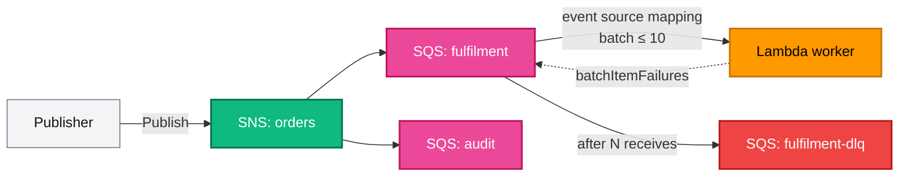

[← Project 06 · Serverless Application](../06-serverless-application/README.md) | [🏠 Home](../../README.md) | [📚 Learning Path](../../docs/00-learning-roadmap/README.md) | [⬆ Projects](../README.md) | [Project 08 · Highly Available Web Infrastructure →](../08-highly-available-web/README.md)

# Project 07 · Event-Driven Architecture

🟡 Intermediate · Do it after the [SNS track](../../aws-services/sns/README.md) · 💰 Per request — very little while idle

## Requirements

1. An **orders** SNS topic that publishers send order events to.
2. **Fan-out** to two SQS queues: `fulfilment` (processed by a worker) and `audit` (kept for later analysis, 14-day retention).
3. A **Lambda worker** consuming `fulfilment` through an event source mapping, in batches of up to 10.
4. Failed messages are retried; after `max_receive_count` failures they go to a **dead-letter queue**. Successful messages in the same batch must **not** be retried.
5. Visibility timeout at least 6× the function timeout.
6. Every queue encrypted; queue policies allow only this topic; the worker role can only consume the fulfilment queue and write its logs.

## Architecture



## Concepts used

| Concept | Where |
| --- | --- |
| `for_each` over a map of resource objects (`local.subscribers`) | queue policies, subscriptions |
| Attribute arithmetic across resources | `visibility_timeout_seconds = aws_lambda_function.worker.timeout * 6` |
| Event source mapping (Lambda polls SQS with the **execution role**) | [worker.tf](worker.tf) |
| Partial batch responses | `function_response_types = ["ReportBatchItemFailures"]` + [src/worker.py](src/worker.py) |
| Redrive to a DLQ | `redrive_policy` in [messaging.tf](messaging.tf) |

## Reference solution

[messaging.tf](messaging.tf) · [worker.tf](worker.tf) · [src/worker.py](src/worker.py) · [variables.tf](variables.tf) · [outputs.tf](outputs.tf)

## Run it

```bash
terraform init
terraform apply
TOPIC=$(terraform output -raw topic_arn)
aws sns publish --topic-arn "$TOPIC" --message '{"id": 1, "status": "paid"}'
aws sns publish --topic-arn "$TOPIC" --message '{"id": 2, "status": "broken"}'   # the worker rejects this one
```

## Verify

```bash
aws logs tail "$(terraform output -raw worker_log_group)" --since 10m --follow
# processed order 1; order 2 fails and is retried

# After max_receive_count (3) failures, order 2 is in the DLQ (allow a few minutes: visibility timeout = 60 s):
aws sqs receive-message --queue-url "$(terraform output -json queue_urls | jq -r .fulfilment_dlq)" \
  --wait-time-seconds 10 --query "Messages[].Body"

# The audit queue received both events:
aws sqs receive-message --queue-url "$(terraform output -json queue_urls | jq -r .audit)" \
  --max-number-of-messages 10 --wait-time-seconds 5 --query "Messages[].Body"
```

## Cleanup

```bash
terraform destroy
```

## Extensions

- A CloudWatch alarm on `ApproximateNumberOfMessagesVisible` of the DLQ > 0, notifying an SNS email topic.
- A filter policy so `audit` only receives `status = paid` events.
- Replace the function's inline role policy with the [iam module](../../modules/iam/README.md).

---

[← Project 06 · Serverless Application](../06-serverless-application/README.md) | [🏠 Home](../../README.md) | [📚 Learning Path](../../docs/00-learning-roadmap/README.md) | [⬆ Projects](../README.md) | [Project 08 · Highly Available Web Infrastructure →](../08-highly-available-web/README.md)
