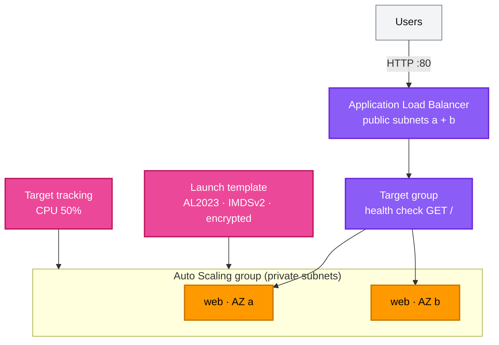

[← Project 07 · Event-Driven Architecture](../07-event-driven-architecture/README.md) | [🏠 Home](../../README.md) | [📚 Learning Path](../../docs/00-learning-roadmap/README.md) | [⬆ Projects](../README.md) | [Project 09 · Production-Style Terraform Architecture →](../09-production-style-infrastructure/README.md)

# Project 08 · Highly Available Web Infrastructure

🟡 Intermediate · Do it after [Chapter 15](../../docs/15-import-and-existing-resources/README.md) (uses a module) · 💰 **Hourly**: Application Load Balancer + 2 × `t3.micro` + ALB public IPv4 addresses. **Destroy promptly.**

## Requirements

1. A VPC across **two AZs**, built with the course's [vpc module](../../modules/vpc/README.md).
2. An **internet-facing Application Load Balancer** in the public subnets.
3. Web servers in **private** subnets, managed by an **Auto Scaling group** (min 2, max 4) from a **launch template**; no NAT gateway (the servers need nothing from the internet).
4. The ASG replaces instances that fail the **load balancer** health check.
5. **Target tracking** scaling on average CPU.
6. Changes to the launch template roll out with an **instance refresh**, keeping at least 50% healthy.
7. Only the ALB can reach the instances.

## Architecture



## Concepts used

| Concept | Where |
| --- | --- |
| Reusing a local module and consuming its outputs | [network.tf](network.tf) |
| ALB, target group, listener | [load_balancer.tf](load_balancer.tf) |
| Launch template, `base64encode()` user data, `tag_specifications` | [autoscaling.tf](autoscaling.tf) |
| `lifecycle { ignore_changes = [desired_capacity] }` | `aws_autoscaling_group.web` |
| `instance_refresh` | `aws_autoscaling_group.web` |
| `name_prefix` limits (6 characters for ALB/target group) | `aws_lb.web` |
| Documented learning shortcuts (HTTP only) | `#checkov:skip` comments |

## Reference solution

[network.tf](network.tf) · [load_balancer.tf](load_balancer.tf) · [autoscaling.tf](autoscaling.tf) · [variables.tf](variables.tf) · [outputs.tf](outputs.tf)

## Run it

```bash
terraform init
terraform apply
sleep 120
URL=$(terraform output -raw url)
for i in 1 2 3 4 5 6; do curl -s "$URL" | grep -o 'Instance [^<]*'; done
```

Responses alternate between instances in different AZs.

## Verify self-healing

```bash
ASG=$(terraform output -raw autoscaling_group_name)
ID=$(aws autoscaling describe-auto-scaling-groups --auto-scaling-group-names "$ASG" \
  --query "AutoScalingGroups[0].Instances[0].InstanceId" --output text)
aws ec2 terminate-instances --instance-ids "$ID"
# watch a replacement appear:
aws autoscaling describe-auto-scaling-groups --auto-scaling-group-names "$ASG" \
  --query "AutoScalingGroups[0].Instances[].[InstanceId,AvailabilityZone,LifecycleState,HealthStatus]" --output table
```

The website keeps answering from the remaining instance while the replacement starts.

**Rolling update:** change the page text in the launch template's user data and apply. The ASG starts an instance refresh; watch it with `aws autoscaling describe-instance-refreshes --auto-scaling-group-name "$ASG"`.

## Cleanup

```bash
terraform destroy
```

## Extensions

- HTTPS listener with an ACM certificate and HTTP→HTTPS redirect (requires a domain).
- Add a NAT gateway (module toggle) and install nginx instead of Python's HTTP server; enable SSM.
- Access logs for the ALB into an S3 bucket.

---

[← Project 07 · Event-Driven Architecture](../07-event-driven-architecture/README.md) | [🏠 Home](../../README.md) | [📚 Learning Path](../../docs/00-learning-roadmap/README.md) | [⬆ Projects](../README.md) | [Project 09 · Production-Style Terraform Architecture →](../09-production-style-infrastructure/README.md)
