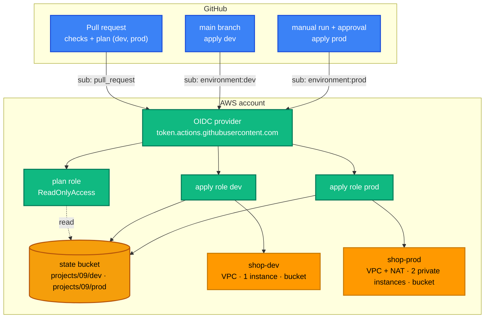

[← Project 08 · Highly Available Web Infrastructure](../08-highly-available-web/README.md) | [🏠 Home](../../README.md) | [📚 Learning Path](../../docs/00-learning-roadmap/README.md) | [⬆ Projects](../README.md)

# Project 09 · Production-Style Terraform Architecture

🟡 Intermediate · Final project — do it after [Chapter 23](../../docs/23-interview-preparation/README.md) · 💰 **dev**: one `t3.micro` + public IPv4; **prod**: NAT gateway + 2 × `t3.small` (hourly). Deploy prod only if you want to see the full flow, and destroy it promptly.

This project brings everything together the way a real team would run it: reusable modules, separate environments with separate remote state, a CI/CD pipeline with OIDC, tests, linting and documentation.

## Requirements

1. **Modules** for all building blocks; environments contain only inputs.
2. **dev** and **prod** as separate root modules with **separate state** in one versioned, encrypted S3 bucket with native locking.
3. **No stored AWS keys**: GitHub Actions authenticates with **OIDC**; a **read-only** role for pull-request plans; **one apply role per environment**, trusted only for jobs running in that GitHub environment.
4. Apply roles limited to the services and name prefixes the stack uses; no path to attach `AdministratorAccess`.
5. Pull requests show the plan for both environments; merges apply **dev** automatically; **prod** needs a manual run and approval.
6. Every pull request runs formatting, validation, module tests, TFLint, Checkov, terraform-docs and link checks.

## Layout

```text
projects/09-production-style-infrastructure/
├── bootstrap/                 # run once, locally, with local state
│   ├── state.tf               # state bucket (modules/s3)
│   ├── oidc.tf                # GitHub OIDC provider + plan/apply roles
│   └── outputs.tf             # values to paste into GitHub settings
├── environments/
│   ├── dev/                   # backend key projects/09/dev/terraform.tfstate
│   │   ├── backend.tf  main.tf  providers.tf  versions.tf  variables.tf  outputs.tf
│   └── prod/                  # backend key projects/09/prod/terraform.tfstate
└── backend.hcl.example        # for local runs against the environments

modules/application-stack      # composition used by both environments
  └── vpc · s3 · iam · ec2     # building blocks (with tests)

.github/workflows/             # check · plan · apply · docs · destroy-example
```

## Architecture



## Step 1 · Bootstrap (locally, once)

```bash
cd projects/09-production-style-infrastructure/bootstrap
cp terraform.tfvars.example terraform.tfvars      # set github_repository to YOUR fork
terraform init
terraform apply
terraform output
```

Set `create_oidc_provider = false` if your account already has the GitHub OIDC provider (only one per account is allowed).

The bootstrap keeps **local state** (the bucket can't store the state of its own creation). Keep `terraform.tfstate` safe, or — as an exercise — add a `backend "s3"` block with key `projects/09/bootstrap/terraform.tfstate` and run `terraform init -migrate-state`.

## Step 2 · Run an environment locally (optional)

```bash
cp ../backend.hcl.example ../backend.hcl          # set the bucket name
cd ../environments/dev
terraform init -backend-config=../../backend.hcl
terraform plan
```

Your own identity needs access to the state bucket and to the resources; the pipeline roles are for GitHub only.

## Step 3 · Connect GitHub

Follow [Chapter 18 §7](../../docs/18-github-actions/README.md#7-turning-it-on-for-your-fork): repository variables `AWS_REGION`, `TF_STATE_BUCKET`, `AWS_PLAN_ROLE_ARN`; environments `dev` and `prod` (restricted to `main`, reviewers on `prod`) each with `AWS_APPLY_ROLE_ARN`.

## Step 4 · Make a change the team way

1. Branch, change `instance_count` in `environments/dev/main.tf`, push, open a PR.
2. **Terraform checks** run; **Terraform plan** comments the dev and prod plans.
3. Merge → **Terraform apply** applies dev.
4. **Actions → Terraform apply (project 09) → Run workflow → prod** → approve → prod is applied.

## How the pieces map to the chapters

| Requirement | Implementation | Chapter |
| --- | --- | --- |
| Modules | `modules/application-stack` → vpc, s3, iam, ec2 | [13](../../docs/13-terraform-modules/README.md) |
| Separate environments | `environments/dev`, `environments/prod` | [14](../../docs/14-workspaces-and-environments/README.md), [21](../../docs/21-best-practices/README.md) |
| Remote state + locking | `backend.tf` with `use_lockfile = true`; bucket from bootstrap | [12](../../docs/12-remote-state/README.md) |
| OIDC, least privilege | [bootstrap/oidc.tf](bootstrap/oidc.tf) | [18](../../docs/18-github-actions/README.md) |
| Tests | `modules/*/tests` (mocked) | [16](../../docs/16-testing-and-validation/README.md) |
| Linting, security, docs | TFLint, Checkov, terraform-docs in CI and pre-commit | [17](../../docs/17-terraform-tooling/README.md) |

## Cleanup

1. Destroy **prod** (locally with `terraform destroy`, using an identity with the needed permissions).
2. Destroy **dev**: run **Actions → Educational: destroy dev (manual)** with `destroy-dev`, or locally.
3. Destroy the bootstrap. The state bucket (from `modules/s3`) has `force_destroy = false`, so empty it first — including all versions — as shown in the [remote-state-bootstrap lab](../../examples/state/remote-state-bootstrap/README.md#cleanup-only-after-the-backend-lab-is-destroyed), then `terraform destroy`.

## Extensions

- A **staging** environment (copy `dev`, change the key and inputs, add a GitHub environment and role).
- Separate AWS **accounts** per environment (one OIDC provider and role per account; `allowed_account_ids` in each `providers.tf`).
- Pin `modules/` by Git tag per environment to promote module versions explicitly.
- Add IAM **permissions boundaries** to roles created by the pipeline.
- Move state and runs to [HCP Terraform](../../docs/19-hcp-terraform/README.md) and compare.

---

[← Project 08 · Highly Available Web Infrastructure](../08-highly-available-web/README.md) | [🏠 Home](../../README.md) | [📚 Learning Path](../../docs/00-learning-roadmap/README.md) | [⬆ Projects](../README.md)
