[← 23 · Interview Preparation](../docs/23-interview-preparation/README.md) | [🏠 Home](../README.md) | [📚 Learning Path](../docs/00-learning-roadmap/README.md) | [Project 01 · Static Website on S3 + CloudFront →](01-static-website/README.md)

# Projects

Nine hands-on builds that combine what the chapters teach. Each project states **requirements** first, so you can try to build it yourself, then provides a complete, working **reference solution** in the same folder.

## How to use a project

1. Read the requirements and the architecture.
2. **Try it yourself** in an empty folder, using the chapters and service tracks.
3. Compare with the reference solution; run it; verify; destroy.
4. Try the extension ideas.

## The projects

| # | Project | Level | Do it after | Main concepts | 💰 While running |
| --- | --- | --- | --- | --- | --- |
| 01 | [Static website](01-static-website/README.md) | 🟢 | Chapter 10 | `for_each` over files, S3 + CloudFront + OAC | Per request |
| 02 | [Custom VPC](02-custom-vpc/README.md) | 🟢 | VPC track | 3-tier multi-AZ network, `dynamic` blocks, NAT modes | Free without NAT |
| 03 | [Web server](03-web-server/README.md) | 🟢 | EC2 track | `templatefile`, security groups, SSM | Hourly |
| 04 | [VPC + EC2 stack](04-vpc-ec2-stack/README.md) | 🟡 | EC2 track | Public proxy + private app, SG chaining | Hourly |
| 05 | [Secure S3](05-secure-s3/README.md) | 🟡 | KMS track | KMS key policies, bucket policies, access logs, IAM roles | Monthly (KMS key) |
| 06 | [Serverless application](06-serverless-application/README.md) | 🟡 | Lambda track | API Gateway, Lambda, DynamoDB, least privilege | Per request |
| 07 | [Event-driven architecture](07-event-driven-architecture/README.md) | 🟡 | SNS track | SNS fan-out, SQS, DLQ, Lambda event source mapping | Per request |
| 08 | [Highly available web](08-highly-available-web/README.md) | 🟡 | Chapter 15 | Module reuse, ALB, Auto Scaling, multi-AZ | **Hourly (ALB)** |
| 09 | [Production-style infrastructure](09-production-style-infrastructure/README.md) | 🟡 | Chapter 23 | Modules, remote state, environments, OIDC CI/CD, tests | Hourly |

```mermaid
flowchart LR
    classDef b fill:#10B981,color:#fff,stroke:#047857,stroke-width:2px
    classDef i fill:#3B82F6,color:#fff,stroke:#1D4ED8,stroke-width:2px
    classDef f fill:#7B42BC,color:#fff,stroke:#5C2D91,stroke-width:2px
    P1["01 Static website"]:::b --> P2["02 Custom VPC"]:::b --> P3["03 Web server"]:::b --> P4["04 VPC + EC2"]:::i
    P4 --> P5["05 Secure S3"]:::i --> P6["06 Serverless"]:::i --> P7["07 Event-driven"]:::i --> P8["08 HA web"]:::i --> P9["09 Production-style"]:::f
```

---

[← 23 · Interview Preparation](../docs/23-interview-preparation/README.md) | [🏠 Home](../README.md) | [📚 Learning Path](../docs/00-learning-roadmap/README.md) | [Project 01 · Static Website on S3 + CloudFront →](01-static-website/README.md)
